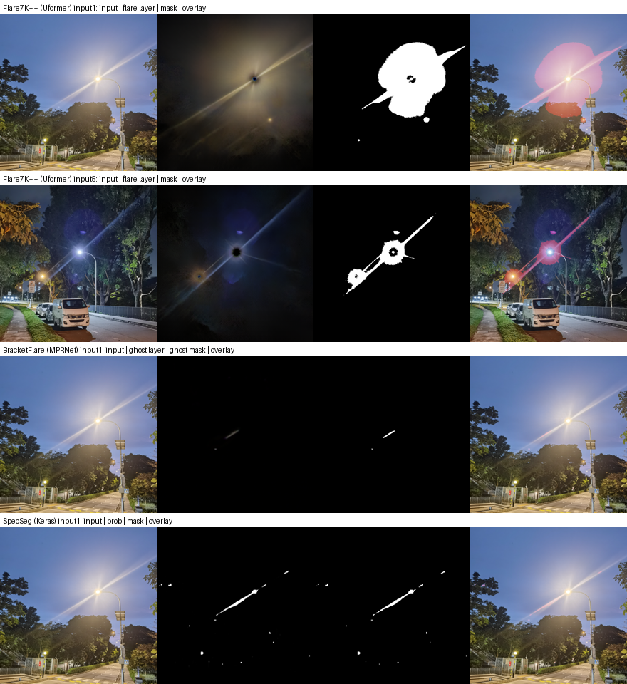

# 三个开源方案：从"跑通"到"输出显式 mask"

目标：只要**显式分割出光晕 mask**，不训练，CPU 可跑，Python 3.10。
`scripts/setup.sh` 一键复现（clone + 建环境 + 下权重 + 拿测试图），下面是已经**实际跑通并验证过**的结果。



（每行 4 列：输入 / 网络预测的光晕层 / 二值 mask / 叠加可视化）

## 环境

| | 版本 |
|---|---|
| Python | 3.10.20（`.venv`、`.venv-tf` 两个 venv，用 uv 建） |
| PyTorch | 2.14.0+cpu（无 GPU，纯 CPU 推理） |
| TensorFlow | 2.15.1 cpu（SpecSeg 单独一个 venv，避免和 torch 抢 numpy/protobuf） |

## 三个方案

| 方案 | 上游仓库 (pin) | 权重 | mask 来源 | 状态 |
|---|---|---|---|---|
| **Flare7K++ / Uformer** | `ykdai/Flare7K` @ `d1fb66e` | Google Drive 82MB | 网络输出 6 通道 = 去光晕图 + **光晕层**，对光晕层阈值化 | ✅ 跑通，8/8 张图 |
| **BracketFlare / MPRNet** | `ykdai/BracketFlare` @ `f48ff7f` | Google Drive 13MB | 同上，光晕层是**反射鬼影**（光心对称先验） | ✅ 跑通，4/4 张图 |
| **SpecSeg / Keras U-Net** | `Atif-Anwer/SpecSeg` @ `0fc1248` | 随仓库自带 hdf5 | **网络直接输出 256×256 sigmoid mask** | ✅ 跑通，5/5 张图 |

`qulishen/FlareX` 也 clone 了，但它只做 removal、不带 mask 头，留作备用数据源。

## 跑法

```bash
bash scripts/setup.sh                       # 首次准备（会下 ~100MB 权重）

# 1) 夜间散射光晕 + 星芒 + 光源
.venv/bin/python tools/flare7kpp_mask_demo.py --input data/real_flare --output outputs/flare7kpp

# 2) 反射鬼影
.venv/bin/python tools/bracketflare_mask_demo.py --input data/real_flare --output outputs/bracketflare

# 3) 镜面高光
.venv-tf/bin/python tools/specseg_mask_demo.py --input data/real_flare --output outputs/specseg
```

每张图输出：`*_flare_soft.png`（连续图）、`*_flare_mask.png`（二值 mask）、`*_light_mask.png`（光源/过曝区）、`*_flare_layer.png`、`*_deflare.png`、`*_overlay.png`。

实测输出（Flare7K++）：

```
[ok] input1.png  512x512  flare_px=15.53%  light_px=0.04%
[ok] input2.png  512x512  flare_px=19.26%  light_px=0.05%
[ok] input3.png  512x512  flare_px=1.21%   light_px=0.10%
[ok] input4.png  512x512  flare_px=0.64%   light_px=0.03%
[ok] input5.png  512x512  flare_px=3.60%   light_px=0.02%
```

## 调试时踩到的三个坑

**1. 上游代码写死 CUDA。** `test.py` 里 `model.cuda()`、`.cuda().unsqueeze(0)`，连 `flare_util.adjust_gamma_reverse()` 内部都有 `gamma.cuda()`。没有改动 `third_party/` 里的任何文件，而是在 `tools/mask_utils.py` 里重写了设备无关的 `gamma_fwd/gamma_inv/split_6ch`（和 `predict_flare_from_6_channel` 数学等价），demo 脚本只 import 上游的网络结构和权重。这样上游仓库保持干净、随时可更新。

**2. 上游根本不输出 mask。** 三个 removal 仓库都只存去光晕图。光晕层要靠 6 通道输出的后 3 通道拿到，再自己转 mask。

**3. 阈值化必须在线性域，而且不能用固定阈值。** 这是最花时间的一步：

- 光晕是**加性半透明层**：`merge_linear = scene_linear + flare_linear`。直接在 gamma 域的像素值上卡阈值不对，要先 `x^2.2` 回线性域。
- 试过"能量占比" `flare/merge > 0.5`：物理上讲得通，但在**暗背景**（夜景里的树丛）上，微弱的 veiling glare 也能占到 >50%，整片树丛被误判成光晕。
- 试过固定绝对阈值：跨曝光完全不通用 —— 实测 input1 的光晕层亮度 p99 = 0.27，input3 只有 0.059，同一个阈值一个全白一个全黑。
- **最后用 Otsu 对线性域光晕亮度自适应阈值**：零超参，三张风格差异很大的图上都给出了干净的"光晕团 + 星芒"分割。`--mask_mode` 仍保留 `rel/ratio/abs` 三种备选。

## 关于 mask 语义的提醒

这套 mask 是"从光晕层反推的"，不是人工标注的 GT。光晕本身是连续的半透明层，二值边界是人为定义的，所以：

- `*_flare_soft.png`（归一化后的光晕层亮度）信息量比二值图大，建议真正训练时用它做**回归监督**，二值 mask 只在需要下游 inpaint / 评测 IoU 时再卡阈值；
- 光源区单独存成 `*_light_mask.png`，不要和光晕合并 —— 所有 removal 方法都强调"去光晕但保留光源"；
- 想要真 GT，用 Flare7K++ 的分层数据在线合成（flare 层已知 ⇒ mask 精确），见 `docs/flare-detection-segmentation-survey.md` 第 5 节。
